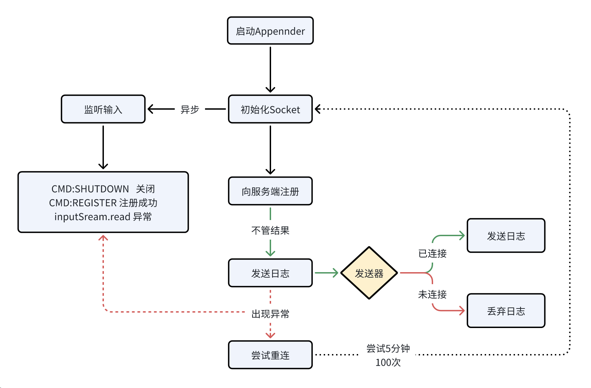
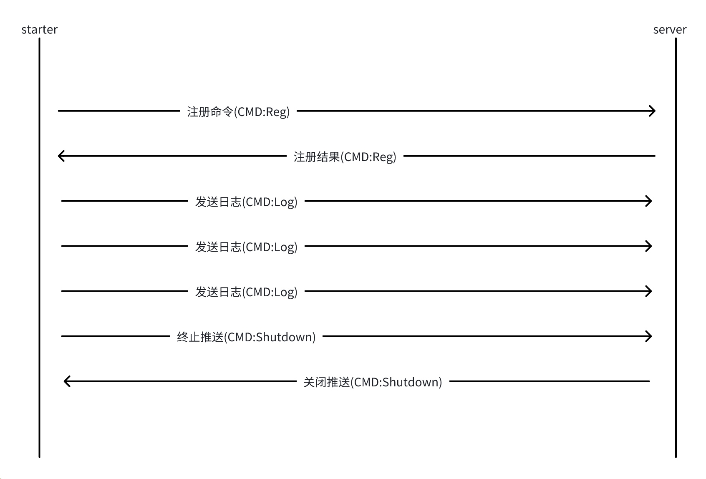

# logback-monitor-starter 

## 设计原理

### 日志监控设计

### 网络传输设计

### 调用链设计
在对外的服务接收到请求时，会创建一个调用链id作为`主调用链id`(mainCallChainId)，并保存到 ThreadLocal 中。

### 集群的处理 todo

### 对非网络请求的处理 todo

### 多线程处理
所使用的 ThreadLocal 是子类 InheritableThreadLocal ，调用链id将被传递给子线程。

### 对网络请求处理
基于 HTTP 的会把调用链id放到请求头中，如果请求头中存在`主调用链id`(MainCallChainId)，则将不会再次创建调用链id，而会创建子调用链id，再当前请求中子调用链的id将保持不变，用于一条调用链中的不同系统。
#### 对 Feign 处理
#### 对 RestTemplate 处理
#### 对 WebClient 处理
#### 对 HTTP 处理
#### 对 Dubbo 处理
#### 对 RMI 处理
